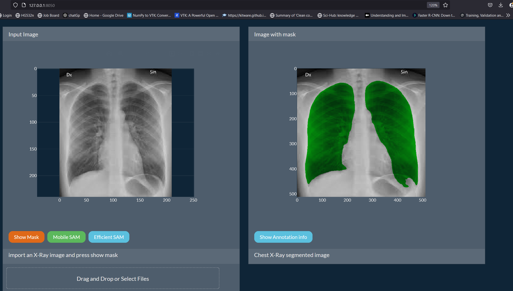
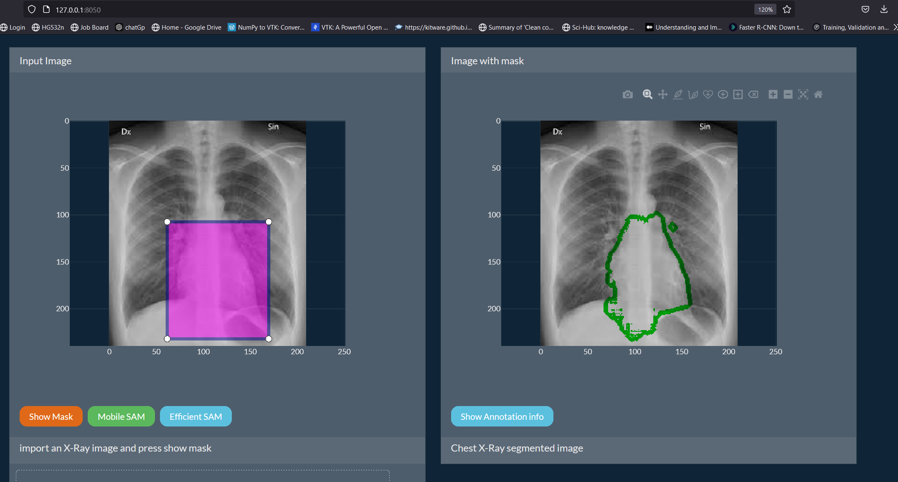

# Segmentator
- Simple Image segmentation app that includes :
    - UNET for Chest s X-Ray segmentation
    - Mobile SAM ( a light  version of SAM )
    - Med SAM (coming soon..)
    - 3D Segmentation utilities (coming soon..)

## How to use

- download the repo
- install requirements
- run `python main.py`
- open http://127.0.0.1:8050/ in browser
- upload image from local
- to use efficient net , download its repo ( it will be neglected by .gitignore don't worry)

### using simple chest UNET
- Drag| upload image
- click `Show Mask`
- you will find a mask for this region

### using Mobile SAM - box prompt
- select rectangle drawer
- draw a bbox
- click `mobile SAM`
- you will find a mask for this region
- edit the box and re-click to update the mask

### TODO:
- [x] view image and mask
- [x] import images
- [/] Handling all images inputs (png , jpg , npy....)
- [x] include Mobile SAM
- [x] include Efficient SAM
- [ ] allow 3D segmentation by 3D UNET
- [ ] allow 3D Medical image segmentation by Med SAM
- [ ] show 3D segmentation 